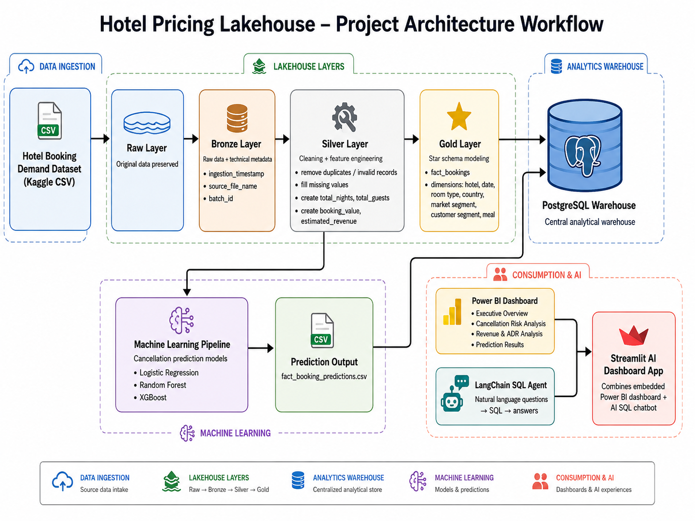
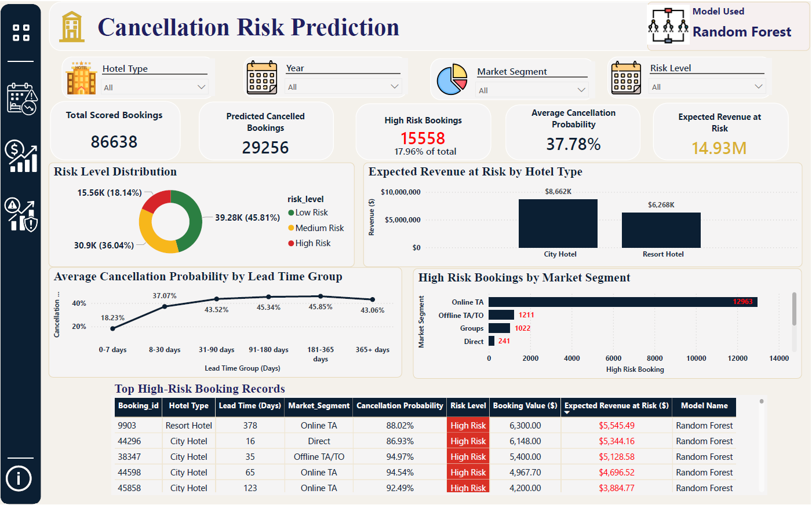

# Hotel Pricing Lakehouse

End-to-end hotel booking analytics project using Python, PostgreSQL, Power BI, machine learning, and a LangChain SQL chatbot to analyze booking demand, cancellation risk, and revenue performance.

## Project Overview

This project analyzes hotel booking data to understand demand patterns, cancellation behavior, revenue performance, and predicted cancellation risk. It follows a lakehouse-style architecture with Bronze, Silver, and Gold layers.

The cleaned and modeled data is loaded into PostgreSQL, visualized in Power BI, extended with a machine learning cancellation model, and connected to an AI SQL agent that allows users to ask business questions in natural language.

## Business Problem

Hotels often face uncertainty around demand, cancellations, and revenue loss. High cancellation rates can reduce expected revenue, while seasonal demand patterns affect pricing, staffing, and marketing decisions.

This project answers questions such as:

- When does hotel booking demand increase or decrease?
- Which hotel type receives more bookings?
- Which market and customer segments are more likely to cancel?
- How much expected revenue is at risk due to cancellations?
- Which months and segments generate the highest revenue?
- Which bookings are predicted to have high cancellation risk?

## Dataset

This project uses the [Hotel Booking Demand Dataset by Jesse Mostipak](https://www.kaggle.com/datasets/jessemostipak/hotel-booking-demand) from Kaggle.

The dataset contains booking records for City Hotel and Resort Hotel, including:

- Booking status
- Arrival date
- Lead time
- Length of stay
- Number of guests
- Market segment
- Customer type
- Room type
- Average Daily Rate
- Special requests

The raw dataset is preserved in the Raw and Bronze layers. Cleaning, feature engineering, modeling, and reporting transformations are applied in later layers.

## Tech Stack

- Python
- Pandas
- Scikit-learn
- PostgreSQL
- Power BI
- LangChain
- OpenAI API
- Streamlit
- Azure DevOps

## Project Architecture



```text
Raw CSV
  -> Bronze layer
  -> Silver cleaning and feature engineering
  -> Gold star schema
  -> PostgreSQL warehouse
  -> Power BI dashboard
  -> Machine learning prediction output
  -> LangChain SQL chatbot and Streamlit app
  -> Azure DevOps CI validation
```

## Data Pipeline

### Raw Layer

The Raw layer stores the original Kaggle dataset without modification.

Output:

- `data/raw/hotel_bookings.csv`

### Bronze Layer

The Bronze layer stores the raw hotel booking dataset with minimal technical metadata added for traceability.

Metadata added:

- `ingestion_timestamp`
- `source_file_name`
- `batch_id`

Output:

- `data/bronze/hotel_bookings_bronze.csv`

No business cleaning is applied in this layer.

### Silver Layer

The Silver layer applies data cleaning and feature engineering.

Cleaning and transformation steps include:

- Filling missing `country` values with `Unknown`
- Filling missing `children`, `agent`, and `company` values with `0`
- Removing duplicate rows
- Removing zero-guest bookings
- Removing zero-night bookings
- Removing invalid ADR values
- Creating `arrival_date`
- Creating `total_nights`
- Creating `total_guests`
- Creating `booking_status`
- Creating `booking_value`
- Creating `estimated_revenue`

Output:

- `data/silver/hotel_bookings_silver.csv`

### Gold Layer

The Gold layer transforms the cleaned Silver data into a star schema for analytics and reporting.

Gold outputs:

- `fact_bookings.csv`
- `dim_hotel.csv`
- `dim_date.csv`
- `dim_room_type.csv`
- `dim_country.csv`
- `dim_market_segment.csv`
- `dim_customer_segment.csv`
- `dim_meal.csv`

These files are loaded into PostgreSQL and used by Power BI and the AI SQL agent.

## Data Model

The Gold layer uses a star schema design with one central fact table and multiple dimension tables.


The fact table contains booking-level metrics such as:

- Cancellation status
- Lead time
- Total nights
- Total guests
- ADR
- Booking value
- Estimated revenue
- Booking changes
- Special requests

Dimension tables provide descriptive context for hotel type, date, room type, country, market segment, customer segment, and meal plan.

## PostgreSQL Warehouse

PostgreSQL is used as the analytical warehouse for the Gold layer and machine learning prediction output.

Main SQL scripts:

- `sql/create_gold_tables.pgsql` creates the Gold fact and dimension tables.
- `sql/load_gold_tables.pgsql` loads Gold CSV files into PostgreSQL.
- `sql/load_prediction.pgsql` creates and loads the prediction table.
- `sql/analytics_queries.pgsql` contains business analysis queries.

Example loading flow:

```powershell
psql -U postgres -d hotel_booking_db -f sql/create_gold_tables.pgsql
psql -U postgres -d hotel_booking_db -f sql/load_gold_tables.pgsql
psql -U postgres -d hotel_booking_db -f sql/load_prediction.pgsql
```

## Power BI Dashboard

The Power BI dashboard visualizes booking demand, cancellation risk, revenue performance, and machine learning prediction results.

Dashboard file:

- `powerbi/Hotel_analysis.pbix`

Embedded dashboard:

[Open Power BI Report](https://app.powerbi.com/reportEmbed?reportId=37198e33-2448-47b6-9619-f129bf3124a2&autoAuth=true&ctid=ef7a487a-77ca-410a-803d-e426b62a587f&actionBarEnabled=false&reportCopilotInEmbed=false)

### Page 1: Executive Overview

Provides a high-level summary of hotel booking performance.


### Page 2: Booking Cancellation Risk Analysis

Identifies where cancellation risk is concentrated and estimates potential revenue loss.


### Page 3: Revenue and ADR Analysis

Analyzes estimated revenue, booking value, ADR, and revenue loss across hotel types, months, and market segments.


### Page 4: Cancellation Prediction

Shows cancellation prediction results from the machine learning model, including model performance and high-risk booking patterns.



## Machine Learning Extension

A supervised machine learning model was developed to predict whether a booking is likely to be cancelled.

Target variable:

- `is_canceled`
  - `0` = Not cancelled
  - `1` = Cancelled

Three models were compared:

| Model | Accuracy | Precision | Recall | F1 Score | ROC-AUC |
|---|---:|---:|---:|---:|---:|
| Logistic Regression | 74.36% | 52.53% | 76.65% | 62.34% | 0.8299 |
| Random Forest | 81.46% | 63.79% | 76.40% | 69.53% | 0.8864 |
| XGBoost | 81.99% | 71.90% | 57.39% | 63.83% | 0.8802 |

Random Forest was selected because it provides a strong balance between recall, precision, F1 score, and ROC-AUC for identifying cancellation risk.

Prediction output:

- `data/ml/fact_booking_predictions.csv`


## AI SQL Agent

This project includes a LangChain-powered SQL chatbot that allows users to ask natural-language questions about the hotel booking warehouse.

The agent connects to PostgreSQL, interprets business questions, generates SQL queries, executes them against the warehouse tables, and returns a business-friendly answer.

Agent capabilities:

- Natural-language question answering
- PostgreSQL warehouse connection
- Access to Gold star schema tables
- Access to machine learning prediction output
- Suggested business questions
- Optional generated SQL display in the Streamlit app
- Interactive terminal and web UI modes

Example questions:

- Which hotel has the highest cancellation rate?
- What is the total expected revenue at risk?
- Which market segment has the most high-risk bookings?
- Which month generated the highest estimated revenue?
- How many bookings were predicted to be cancelled?

## Streamlit AI Dashboard App

A Streamlit app combines the embedded Power BI dashboard, AI SQL chatbot, and documentation RAG chatbot in one interface.

Streamlit features:

- Embedded Power BI report
- SQL chatbot tab
- Project documentation Q&A tab
- Suggested question buttons
- Model selector
- Generated SQL visibility toggle
- Chat history

## Documentation RAG Chatbot

The project also includes a lightweight Retrieval-Augmented Generation chatbot for project documentation.

The RAG chatbot reads:

- `README.md`
- `docs/*.md`

It retrieves relevant documentation chunks and uses the language model to answer methodology and project-explanation questions.

Example RAG questions:

- What cleaning steps were applied in the Silver layer?
- Why was Random Forest selected as the final model?
- What are the main business findings from the analysis?
- How does the Gold star schema support reporting?
- What are the limitations of this project?

This complements the SQL agent:

| Agent Type | Best For |
|---|---|
| SQL chatbot | Metrics, KPIs, aggregations, and warehouse questions |
| RAG chatbot | Documentation, methodology, findings, and explanation questions |

## CI Pipeline

This project includes an Azure DevOps CI pipeline defined in `azure-pipelines.yml`.

The pipeline runs automatically on pushes and pull requests targeting `main`.

CI checks include:

- Setting up Python 3.11
- Installing dependencies from `requirements.txt`
- Checking Python syntax for the agent and Streamlit files
- Testing that the RAG chatbot can index `README.md` and `docs/*.md`
- Checking required project files
- Validating SQL warehouse scripts
- Validating key CSV output schemas
- Running basic data quality checks
- Starting the Streamlit app and checking its health endpoint

The CI pipeline does not call the OpenAI API or connect to PostgreSQL. This keeps the first CI version stable, fast, and safe for pull request validation.

Run the app:

```powershell
streamlit run agent/03_streamlit_sql_chatbot.py
```

Then open:

```text
http://localhost:8501
```


## Repository Structure

```text
hotel-pricing-lakehouse/
|
|-- agent/
|   |-- 01_test_db_connection.py
|   |-- 02_sql_chatbot.py
|   |-- 03_streamlit_sql_chatbot.py
|   |-- rag_doc_core.py
|   |-- sql_agent_core.py
|
|-- data/
|   |-- raw/
|   |-- bronze/
|   |-- silver/
|   |-- gold/
|   |-- ml/
|
|-- docs/
|   |-- bronze_layer.md
|   |-- silver_layer.md
|   |-- gold_layer.md
|   |-- data_exploration_findings.md
|
|-- models/
|   |-- random_forest_cancellation_model.pkl
|
|-- notebooks/
|   |-- 01_data_exploration.ipynb
|   |-- 02_bronze_ingestion.ipynb
|   |-- 03_silver_cleaning.ipynb
|   |-- 04_gold_modeling.ipynb
|   |-- 05_cancellation_prediction_model.ipynb
|
|-- powerbi/
|   |-- Hotel_analysis.pbix
|   |-- images/
|
|-- sql/
|   |-- create_gold_tables.pgsql
|   |-- load_gold_tables.pgsql
|   |-- load_prediction.pgsql
|   |-- analytics_queries.pgsql
|
|-- requirements.txt
|-- azure-pipelines.yml
|-- README.md
```

## Data Quality Decisions

| Issue | Action |
|---|---|
| Missing country | Filled with `Unknown` |
| Missing children | Filled with `0` |
| Missing agent/company | Filled with `0` |
| Negative ADR | Removed |
| Zero guests | Removed |
| Zero-night bookings | Removed |
| Duplicates | Removed during Silver cleaning |

## Key Business Insights

- City Hotel generated higher booking volume than Resort Hotel and showed stronger cancellation risk.
- Booking demand and estimated revenue were strongest during mid-year months, especially July and August.
- Cancelled bookings created meaningful expected revenue loss, making cancellation risk an important operational issue.
- Online TA and long lead-time bookings showed stronger cancellation risk patterns.
- The Random Forest model helps estimate cancellation probability and expected revenue at risk for future booking records.

## Security Notes

- `.env` is excluded from Git and should not be committed.
- API keys and database passwords should be stored only in local environment variables.
- In a production deployment, the SQL agent should connect using a read-only database user.
- Additional SQL validation should be added before allowing public access.
- In Azure DevOps, secrets should be stored in secure variables or Azure Key Vault instead of `.env`.

## Future Improvements

- Add stricter SQL validation to allow only read-only `SELECT` queries.
- Add unit tests for RAG tokenization, chunking, and retrieval logic.
- Add integration tests using a temporary PostgreSQL database.
- Move PostgreSQL to a cloud database for deployment.
- Add Azure Key Vault, Application Insights, and Log Analytics for production readiness.
- Add CD to deploy the Streamlit app to Azure App Service after CI passes.

## Author

Created by Chan Xu Peng.
