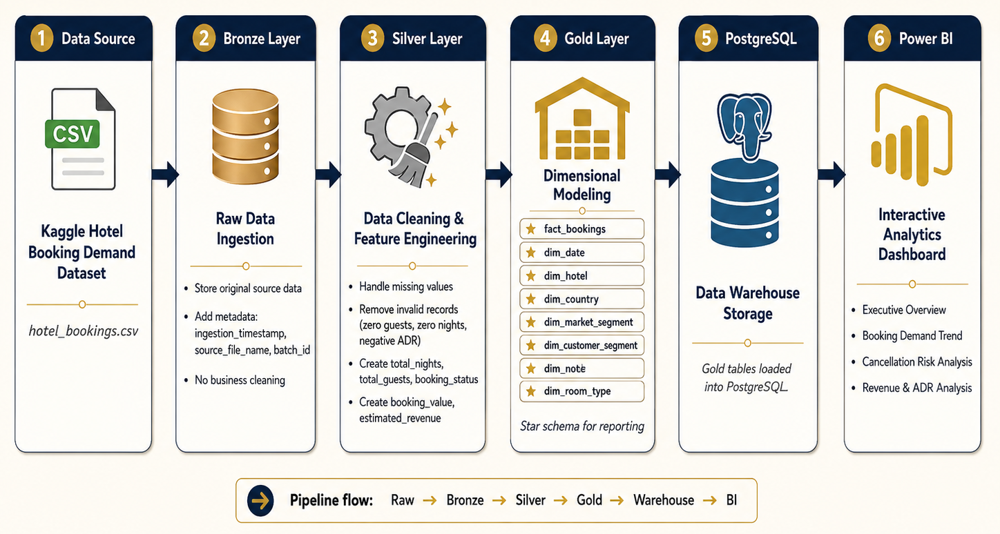
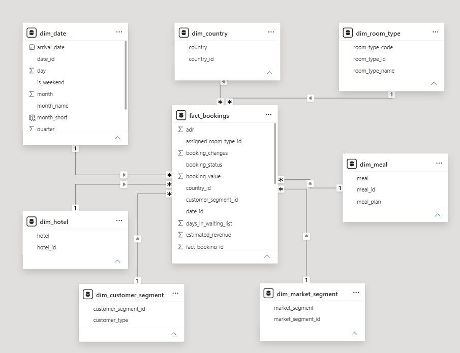
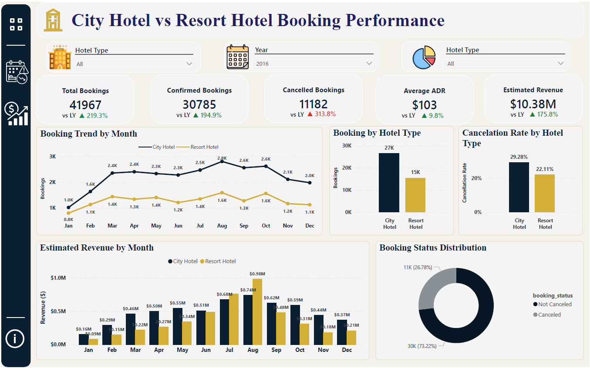
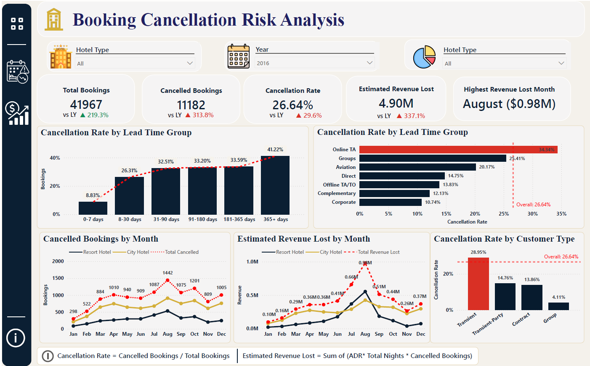
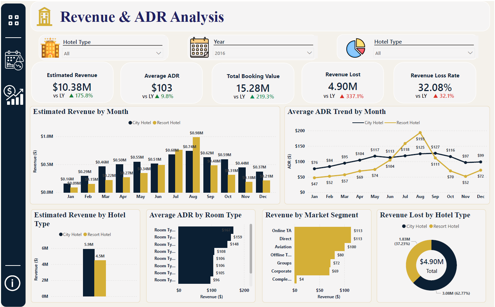

# Hotel-Pricing-Lakehouse

### End-to-end hotel booking analytics project using Python, PostgreSQL, and Power BI to analyze booking demand, cancellation risk, and revenue performance.

## 📌Project Overview

This project analyzes hotel booking data to identify booking demand patterns, cancellation risk, and revenue performance across hotel types, market segments, customer types, and time periods. The project follows a lakehouse-style architecture with Bronze, Silver, and Gold layers. Cleaned and modeled data is loaded into PostgreSQL and visualized in Power BI through an interactive business dashboard.

## ❓Business Problem

Hotels often face uncertainty in booking demand, cancellations, and revenue performance. High cancellation rates can reduce expected revenue, while seasonal demand patterns affect staffing, pricing, and marketing decisions.

This project aims to answer the following business questions:

- When does hotel booking demand increase or decrease?
- Which hotel type receives more bookings?
- Which customer or market segments are more likely to cancel?
- How much potential revenue is lost due to cancellations?
- Which months and segments generate the highest revenue?

## 📂Dataset

The dataset used in this project is the Hotel Booking Demand dataset from Kaggle.

Source: This project uses the [Hotel Booking Demand Dataset by Jesse Mostipak](https://www.kaggle.com/datasets/jessemostipak/hotel-booking-demand) from Kaggle.

The dataset contains booking records for City Hotel and Resort Hotel, including information such as:

- Booking status
- Arrival date
- Lead time
- Length of stay
- Number of guests
- Market segment
- Customer type
- Room type
- Average Daily Rate
- Special requests

The raw dataset is not modified in the Bronze layer. Data cleaning and business transformations are applied in the Silver and Gold layers.

## 🏗️Project Architecture



## Data Pipeline

### Bronze Layer

The Bronze layer stores the raw hotel booking dataset with minimal changes. Technical metadata columns are added for traceability:

- `ingestion_timestamp`
- `source_file_name`
- `batch_id`

No business cleaning is applied at this stage.

### Silver Layer

The Silver layer applies data cleaning and feature engineering. Key cleaning steps include:

- Handling missing values in `country`, `agent`, `company`, and `children`
- Removing invalid records such as zero guests and zero-night bookings
- Removing negative ADR values
- Creating useful business columns such as:
  - `total_nights`
  - `total_guests`
  - `booking_status`
  - `booking_value`
  - `estimated_revenue`

### Gold Layer

The Gold layer transforms the cleaned Silver data into a star schema for reporting and analysis. The Gold layer includes one fact table and multiple dimension tables.

## Data Model

The Gold layer uses a star schema design to support efficient reporting in Power BI.


The fact table contains booking-level metrics such as total nights, total guests, ADR, booking value, estimated revenue, cancellation status, and booking changes.'

## Power BI Dashboard

### Page 1: Executive Overview

Provides a high-level summary of hotel booking performance.


### Page 2: Booking Cancellation Risk Analysis

Identifies where cancellation risk is concentrated and estimates potential revenue loss.


### Page 3: Revenue & ADR Analysis

Analyzes estimated revenue, booking value, ADR, and revenue loss across hotel types, months, and market segments.


## Key Business Insights

- Total bookings increased strongly compared with last year, showing strong demand growth.
- City Hotel generated higher booking volume than Resort Hotel.
- City Hotel also had a higher cancellation rate, meaning it should be prioritized for cancellation reduction strategies.
- Revenue peaked during mid-year months, especially around July and August.
- Although ADR increased, revenue lost from cancellations remained significant.
- Longer lead time bookings and specific market segments showed higher cancellation risk.

## Repository Structure

```text
hotel-pricing-lakehouse/
│
├── data/
│   ├── raw/
│   ├── bronze/
│   ├── silver/
│   └── gold/
│
├── notebooks/
│   ├── 01_data_exploration.ipynb
│   ├── 02_bronze_ingestion.ipynb
│   ├── 03_silver_cleaning.ipynb
│   └── 04_gold_modeling.ipynb
│
├── sql/
│   ├── create_gold_tables.sql
│   ├── load_gold_tables.sql
│   └── analysis_queries.sql
│
├── powerbi/
│   └── hotel_booking_dashboard.pbix
│   └── images/
│
├── docs/
│   ├── bronze_layer.md
│   ├── silver_layer.md
│   ├── gold_layer.md
│   └── data_dictionary.md
│
│
└── README.md
```

## Data Quality Decisions

| Issue                 | Action                     |
| --------------------- | -------------------------- |
| Missing country       | Filled with `Unknown`      |
| Missing children      | Filled with `0`            |
| Missing agent/company | Filled with `0`            |
| Negative ADR          | Removed                    |
| Zero guests           | Removed                    |
| Zero-night bookings   | Removed                    |
| Duplicates            | Checked during exploration |

## Author

Created by Xu Peng

Portfolio project focused on data engineering, business intelligence, and analytics reporting.
